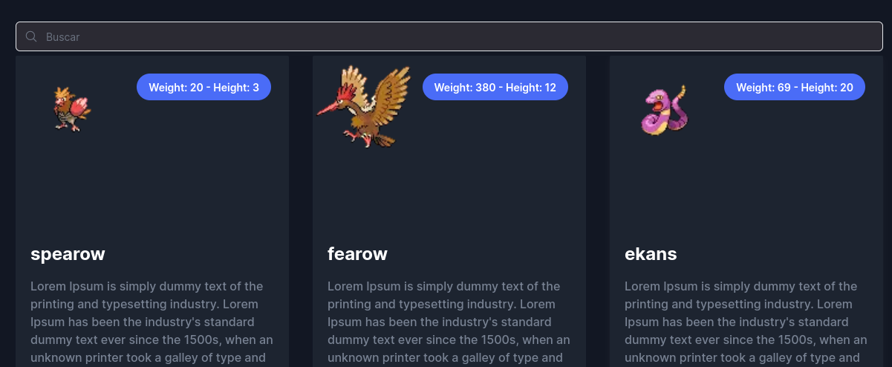
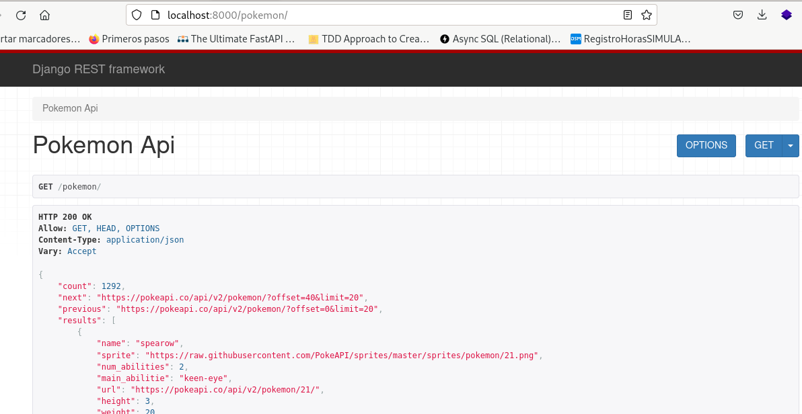
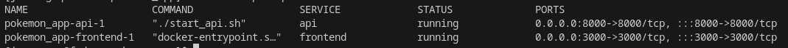

# POKEMON FULL STACK APP

La presente application consta de dos partes:
## Frontend: Aplicación desarrollada con react utilizando el Framework NextJS.



El front utiliza la plantilla  [startup]([https://](https://startup.nextjstemplates.com/))

## Backend: API construida usando Django Rest Framework 


## Pasos para desplegar la Aplicación

1. Tener instalado docker y docker-compose. Seguir los pasos de instalación de la [página de docker]([https://](https://docs.docker.com/engine/install/))
2. Clonar el repositorio
   ```
   git clone https://github.com/juliosarango/pokemon_app.git
   ```
3. Entrar a la carpeta del proyecto
   ```
   cd pokemon_app
   ```
4. Levantar los contenedores usando el siguiente comando. Este comando primeramente construirá dos imágenes: una para el front y otra para el back
   ```
   docker-compose up -d --build
   ```
5. Ver la ejecución de los contenedores
   ```
   docker-compose ps
   ```
   
6. Abrir el navegador en la siguiente url
   ```
   http://localhost:3000/pokemon
   ```
   Se mostrará la applicación.
   

7. Seleccionar cualquier pokemon para ver su detalle